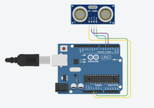
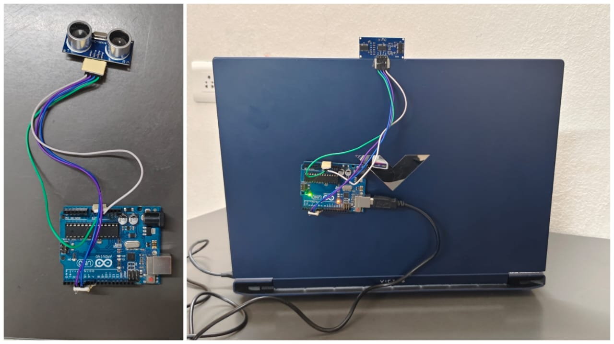

# Gesture Control PC / Laptop using Arduino

This project implements a **gesture-based control system for a computer** using **Arduino UNO, ultrasonic sensors, and Python automation**.

The system allows users to control media playback and system functions using simple **hand gestures**, eliminating the need for a traditional mouse or keyboard.

---

## Project Overview

Gesture recognition enables computers to understand human hand movements and translate them into commands.  
In this project, two **HC-SR04 ultrasonic sensors** detect the distance of the user's hand from the monitor.

The sensor data is processed by **Arduino UNO** and sent to the computer via **serial communication**.  
A **Python script using the pyautogui library** interprets these commands and performs actions such as play/pause, fast forward, rewind, and volume control.

---

## Hardware Components

- Arduino UNO
- HC-SR04 Ultrasonic Sensors (2)
- Jumper wires
- USB cable
- Laptop / PC

---

## Software Stack

- Arduino IDE
- Python
- PyAutoGUI library
- Serial communication

---

## Circuit Diagram

---

## Hardware Setup

---

## System Workflow

1. Ultrasonic sensors detect the distance between the hand and the sensor.
2. Arduino calculates the distance and determines the gesture.
3. Arduino sends the command through serial communication.
4. Python reads the command and performs the corresponding action.
5. The computer executes the action (play/pause, volume control, etc.).

---

## Supported Gestures

| Gesture | Action |
|------|------|
| Both hands detected | Play / Pause video |
| Right hand gesture | Fast Forward |
| Left hand gesture | Rewind |
| Hand moving closer | Increase volume |
| Hand moving away | Decrease volume |

---

## Repository Structure
'''
gesture-control-pc
│
├── arduino
│ └── gesture_control.ino
│
├── python
│ └── gesture_control.py
│
├── images
│ ├── circuit_diagram.png
│ └── hardware_setup.jpg
│
├── report
│ └── GESTURE_CONTROL_REPORT.pdf
│
└── README.md
'''
---

## Applications

- Touchless media control
- Human-computer interaction research
- Smart home control interfaces
- Interactive presentations

---

## Future Improvements

- Improve gesture recognition accuracy
- Add more gesture commands
- Integrate computer vision-based gesture detection
- Use machine learning for gesture classification

---

## Author

**Shaik Naved Ahmed**  
B.Tech – Computer Science & Artificial Intelligence  
SR University, Warangal
